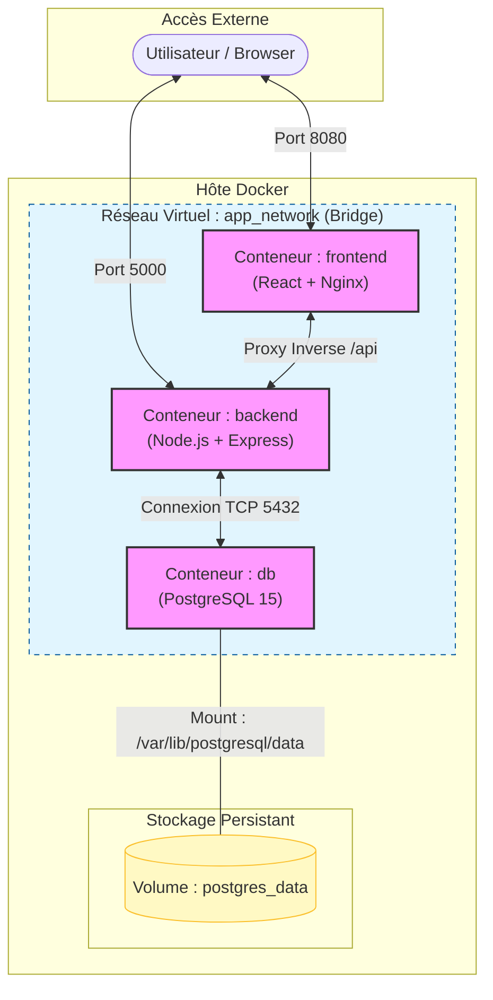

Architecture Technique du Projet

Ce document détaille l'organisation des conteneurs, des réseaux, des volumes et les flux de données de l'application.

diagrama Mermaid de l'Architecture

1. Les Conteneurs (Services)

| Service | Rôle | Image de base | Ports |
| :--- | :--- | :--- | :--- |
| Frontend | Interface utilisateur React. Les fichiers statiques sont servis par un serveur Nginx optimisé. | `nginx:stable-alpine` | 8080 (Hôte) -> 80 (Conteneur) |
| Backend | API REST Node.js/Express. Gère la logique métier et la communication avec la base de données. | `node:20-slim` | 5000 (Hôte) -> 5000 (Conteneur) |
| DB | Base de données relationnelle persistante. | `postgres:15-alpine` | 5432 (Conteneur uniquement) |

2. Réseaux (Networking)

- Nom : app_network
- Type : bridge
- Description : Tous les services sont isolés dans ce réseau privé. Ils communiquent entre eux en utilisant leurs noms de services comme noms d'hôtes (DNS interne de Docker). 
    - Exemple : Le backend contacte la base de données via host: db.
    - Le frontend redirige les appels /api vers http://backend:5000.

3. Volumes (Persistance)

- Nom : postgres_data
- Cible : /var/lib/postgresql/data dans le conteneur db.
- Utilité : Garantit que les données de la base (tables, enregistrements) ne sont pas perdues lors d'un docker compose down ou d'une mise à jour de l'image de la base de données.

4. Flux de Navigation et de Données

1. Accès Web : L'utilisateur charge l'application via le port 8080. Nginx renvoie l'application React.
2. Appels API : 
   - Le navigateur envoie une requête vers http://localhost:8080/api/health.
   - Nginx (dans le conteneur frontend) intercepte le préfixe /api et le transfère au conteneur backend sur le port 5000.
3. Accès DB : Le backend exécute des requêtes SQL vers le service db sur le port 5432.
4. Réponse : Le flux remonte jusqu'à l'utilisateur pour mettre à jour l'interface.
